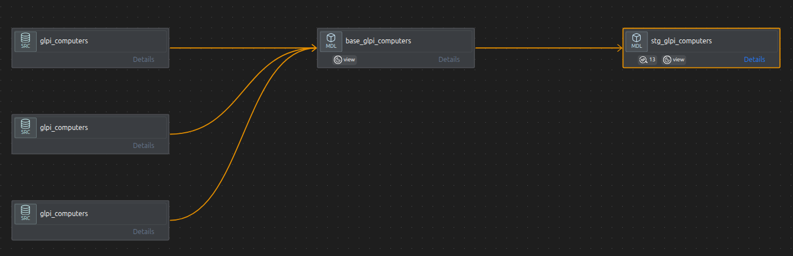

# Staging Layer — Atomic Data Foundation

The staging layer transforms raw data from **GLPI** and **OCS** into clean, standardized, and reliable datasets. It acts as the foundation of the data pipeline, ensuring that all downstream models (analytics, dashboards, ML) are built on trusted data.



---

## Project Structure

```
models/
└── staging/
    ├── base/
    │   ├── glpi/
    │   └── ocs/
    ├── glpi/
    └── ocs/
tests/
├── glpi/
└── ocs/
```

---

## Naming Convention

```
stg_[source]__[entity].sql
```

**Examples:** `stg_glpi__tickets.sql` · `stg_glpi__ticketfollowups.sql` · `stg_ocs__hardware.sql` · `stg_ocs__drives.sql`

---

## Objectives

- Clean raw data
- Standardize column names and formats
- Handle multi-source datasets (2013–2015)
- Generate stable primary keys
- Detect and manage data quality issues
- Prepare atomic datasets for reuse

---

## Core Transformations

### 1. Column Standardization

| Raw         | Staged        |
|-------------|---------------|
| `date`      | `created_at`  |
| `solvedate` | `solved_at`   |
| `closedate` | `closed_at`   |
| `year`      | `source_year` |

### 2. Composite Primary Keys

IDs are not unique across years — composite keys are built as:

```sql
CONCAT(year, '_', id) AS <entity>_pk
```

### 3. Multi-Source Integration

Data comes from `glpi_2013`, `glpi_2014`, and `glpi_2015`, unified via:

```
base_* → stg_*
```

### 4. Data Cleaning

**Invalid dates** (e.g. `solved_at < created_at`) are nullified:

```sql
CASE
    WHEN solvedate < date THEN NULL
    ELSE solvedate
END
```

**Text cleaning:** empty values (`''`, `'-'`) removed · HTML entities decoded (`&gt;`) · `TRIM` and `LOWER` applied

**Boolean normalization:**

```sql
CASE WHEN is_private = 1 THEN 1 ELSE 0 END
```

---

## OCS Hardware Enrichment

### CPU
- Core count extracted from raw string
- Architecture normalized to `x86` / `x64`

### RAM
- Converted from MB → GB
- Classified into tiers: `invalid_or_legacy` · `low` · `medium` · `high`

### Drives
- Computed: `total_gb`, `used_gb`, `free_gb`, `usage_ratio`
- Type classified: `disk` · `cdrom` · `removable`
- `disk_risk_level` flag added

### BIOS
- Serial numbers cleaned
- Multiple date formats parsed
- `bios_age_years` computed

---

## Activity Classification

Activity is derived dynamically using a window function rather than static thresholds:

```sql
NTILE(3) OVER (ORDER BY LASTDATE DESC)
```

This produces balanced `active` / `inactive` / `stale` buckets even on temporally compressed datasets.

---

## Data Quality Testing

A multi-level testing strategy is applied across all models.

### Schema Tests
- Primary keys: `unique`, `not_null`
- Controlled vocabularies: `accepted_values`
- Critical fields: `not_null`

### Data Quality Tests
- No negative values
- Valid date ranges
- Clean text fields
- Consistent calculations

### Business Logic Tests

**Tickets**
- `solved_at >= created_at`
- Non-negative durations

**Hardware**
- CPU cores > 0
- RAM consistency
- OS classification validity

**Drives**
- Usage ratio within [0, 1]
- Storage consistency
- Risk level correctness

> **Note:** Not all anomalies are errors. Duplicate devices in OCS are expected (multiple scans) and are flagged as `WARN`, not `FAIL`.
---

## Known Issues & Solutions

| Issue | Cause | Solution |
|---|---|---|
| Duplicate IDs | Multi-year data | Composite primary key |
| Invalid dates | Dirty source data | Nullification |
| MySQL `0000-00-00` dates | Bad datetime values | Safe casting |
| Duplicate devices | Multiple OCS scans | Handled in downstream layer |
| OS inconsistencies | Multilingual data | Flexible pattern matching |

---

## Materialization Strategy

All staging models are materialized as **views**.

```yaml
materialized: view
```
This keeps them always up-to-date, avoids storage overhead, and reflects that staging is not intended for direct BI consumption.
---
## Design Principles
The staging layer is intentionally **atomic**. It avoids aggregations, KPIs, and filtering — focusing instead on clean, consistent, reusable datasets that can be safely referenced by any downstream model.
---
## Output
The staging layer produces:
- Clean GLPI datasets: tickets, users, logs, …
- Clean OCS datasets: hardware, drives, BIOS, …
- Unified structure across 2013–2015
- Feature-ready data for downstream modeling
---
## Pipeline Continuation
```
stg_*
  ↓
int_*        ← feature engineering
  ↓
dim_devices / fct_tickets
  ↓
ML models
```

---

> The staging layer is not just preprocessing — it is where **data trust is established**. A strong staging layer guarantees reliable analytics, accurate dashboards, and trustworthy AI models.
