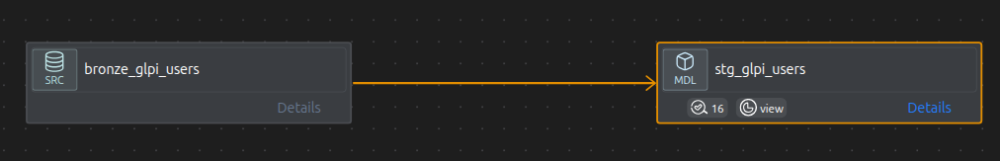
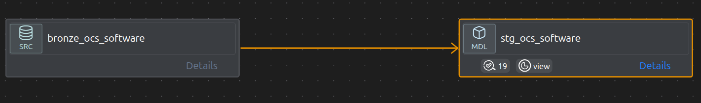
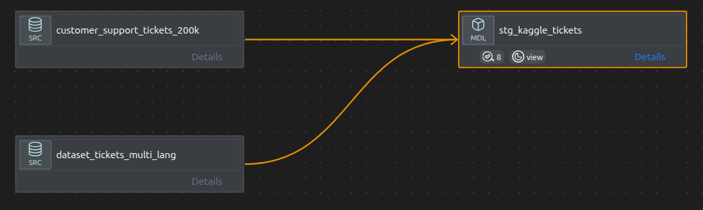

# Staging Layer — Atomic Data Foundation

The **Staging Layer** is the second layer of the `bronze-airflow-warehouse` architecture. It transforms raw ingested data from the Bronze layer into standardized, cleaned, and analytics-ready datasets using **dbt (Data Build Tool)**, acting as a normalization and quality-control layer between raw ingestion and future analytical/machine learning layers.

---

## Architecture Position

```
Source Systems / Kaggle Datasets
            ↓
        Bronze Layer
   (Raw Ingestion Tables)
            ↓
       Staging Layer         ← You are here
 (Cleaned & Standardized Views)
            ↓
     Intermediate Layer
    (Business Transformations)
            ↓
         Mart Layer
 (Analytics / BI / AI Features)
```

---

## Pipeline DAGs

**GLPI**


**OCS**


**Kaggle**


---

## Technologies Used

| Technology | Purpose |
|------------|---------|
| Airflow    | Orchestration & ingestion |
| dbt        | SQL transformations |
| MySQL      | Data warehouse |
| Docker     | Containerized infrastructure |
| Python     | Data ingestion scripts |

---

## Project Structure

```
models/
└── staging/
    ├── base/
    │   ├── glpi/
    │   └── ocs/
    ├── glpi/
    └── ocs/
tests/
├── glpi/
└── ocs/
```

---

## Naming Convention

```
stg_[source]__[entity].sql
```

**Examples:** `stg_glpi__tickets.sql` · `stg_glpi__ticketfollowups.sql` · `stg_ocs__hardware.sql` · `stg_ocs__drives.sql`

| Layer               | Prefix  |
|---------------------|---------|
| Staging Models      | `stg_`  |
| Intermediate Models | `int_`  |
| Mart Models         | `mart_` |

---

## Objectives

- Clean raw data from multiple source systems
- Standardize column names and formats
- Handle multi-source datasets (2013–2015)
- Generate stable composite primary keys
- Detect and manage data quality issues
- Prepare atomic datasets for downstream reuse

---

## Materialization Strategy

All staging models are materialized as **views**:

```yaml
materialized: view
```

This provides lightweight transformations, no duplicated storage, real-time reflection of Bronze data, and faster development cycles. Staging views are not intended for direct BI consumption.

---

## Core Transformations

### 1. Column Standardization

| Raw          | Staged        |
|--------------|---------------|
| `date`       | `created_at`  |
| `solvedate`  | `solved_at`   |
| `closedate`  | `closed_at`   |
| `year`       | `source_year` |

### 2. Composite Primary Keys

IDs are not unique across years — composite keys are generated as:

```sql
CONCAT(year, '_', id) AS <entity>_pk
```

### 3. Multi-Source Integration

Data comes from `glpi_2013`, `glpi_2014`, and `glpi_2015`, unified via the `base_* → stg_*` pattern.

### 4. Data Cleaning

**Invalid dates** are nullified:

```sql
CASE
    WHEN solvedate < date THEN NULL
    ELSE solvedate
END
```

**Text cleaning:** empty values (`''`, `'-'`) removed · HTML entities decoded (`&gt;`) · `TRIM` and `LOWER` applied

**Boolean normalization:**

```sql
CASE WHEN is_private = 1 THEN 1 ELSE 0 END
```

**NULL handling** — invalid values converted to NULL:

```sql
'', '0', '0000-00-00'
```

### 5. Surrogate Keys

Stable unique identifiers generated using:

```sql
MD5(...)
```

Ensures uniqueness across multiple years, duplicated source IDs, and heterogeneous datasets.

---

## Data Domains

### GLPI ITSM Data
Tickets · Users · Logs · Followups · Computers · Processors · Memories · Graphic Cards · ITIL Categories · Asset Information

### OCS Inventory Data
Hardware · BIOS · Drives · Networks · Memories · Software · Storages

### Kaggle / External Datasets
CVE Vulnerability Data · Windows Event Logs · Hard Drive SMART Metrics · Laptop Pricing Data · Customer Support Tickets · Multilingual Ticket Datasets

---

## OCS Hardware Enrichment

### CPU
- Core count extracted from raw string
- Architecture normalized to `x86` / `x64`

### RAM
- Converted from MB → GB
- Classified into tiers: `invalid_or_legacy` · `low` · `medium` · `high`

### Drives
- Computed fields: `total_gb`, `used_gb`, `free_gb`, `usage_ratio`
- Type classified: `disk` · `cdrom` · `removable`
- `disk_risk_level` flag added

### BIOS
- Serial numbers cleaned
- Multiple date formats parsed
- `bios_age_years` computed

---

## Derived Features & Flags

### Boolean Flags
`has_failed` · `is_private` · `is_critical` · `suspicious_activity` · `has_ssd`

### Derived Business Features
`severity_level` · `performance_tier` · `price_segment` · `health_status` · `gpu_brand` · `software_category`

### Activity Classification

Activity is derived dynamically using a window function rather than static thresholds:

```sql
NTILE(3) OVER (ORDER BY LASTDATE DESC)
```

This produces balanced `active` / `inactive` / `stale` buckets even on temporally compressed datasets.

---

## Data Quality & Testing

A multi-level testing strategy is applied across all models.

### Schema Tests
- Primary keys: `unique`, `not_null`
- Controlled vocabularies: `accepted_values`
- Critical fields: `not_null`

### Data Quality Tests
- No negative values
- Valid date ranges
- Clean text fields
- Consistent calculations

### Business Logic Tests

**Tickets**
- `solved_at >= created_at`
- Non-negative durations

**Hardware**
- CPU cores > 0
- RAM consistency
- OS classification validity

**Drives**
- Usage ratio within [0, 1]
- Storage consistency
- Risk level correctness

> **Note:** Not all anomalies are errors. Duplicate devices in OCS are expected (multiple scans) and are flagged as `WARN`, not `FAIL`.

Custom SQL business validation rules live in:

```
tests/
```

---

## Example Models

| Model                         | Purpose                              |
|-------------------------------|--------------------------------------|
| `stg_glpi_tickets`            | Clean ITSM tickets                   |
| `stg_glpi_users`              | Standardized user data               |
| `stg_ocs_hardware`            | Standardized hardware inventory      |
| `stg_ocs_drives`              | Disk inventory with risk flags       |
| `stg_cve_kaggle`              | Cybersecurity vulnerabilities        |
| `stg_harddrive_kaggle`        | Disk failure prediction              |
| `stg_windows_eventlog_kaggle` | Security event analysis              |
| `stg_kaggle_tickets`          | Multilingual support ticket dataset  |

---

## Known Issues & Solutions

| Issue               | Cause                  | Solution                        |
|---------------------|------------------------|---------------------------------|
| Duplicate IDs       | Multi-year data        | Composite primary key           |
| Invalid dates       | Dirty source data      | Nullification                   |
| `0000-00-00` dates  | Bad MySQL datetime     | Safe casting                    |
| Duplicate devices   | Multiple OCS scans     | Handled in downstream layer     |
| OS inconsistencies  | Multilingual data      | Flexible pattern matching       |

---

## AI & Analytics Readiness

The staging layer is designed to support future:

- Predictive maintenance
- Ticket classification
- Failure prediction
- Security anomaly detection
- ITSM analytics
- NLP pipelines
- RAG systems
- LLM fine-tuning datasets

---

## Pipeline Continuation

```
stg_*
  ↓
int_*        ← feature engineering
  ↓
dim_devices / fct_tickets
  ↓
ML models
```

---

## Design Philosophy

The staging layer is intentionally **atomic**. It avoids aggregations, KPIs, and filtering — focusing instead on clean, consistent, reusable datasets that can be safely referenced by any downstream model.

It follows modern Data Engineering principles:

- ELT architecture
- Modular SQL transformations
- Reproducibility
- Test-driven transformations
- Scalability
- Domain-oriented modeling
- Analytics engineering best practices

---

> The staging layer is not just preprocessing — it is where **data trust is established**. A strong staging layer guarantees reliable analytics, accurate dashboards, and trustworthy AI models.